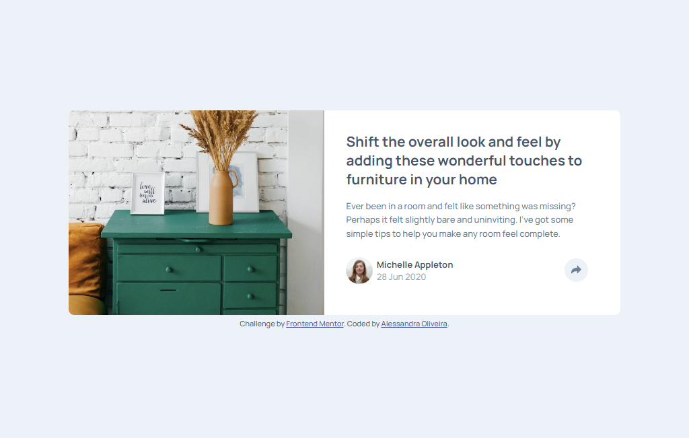
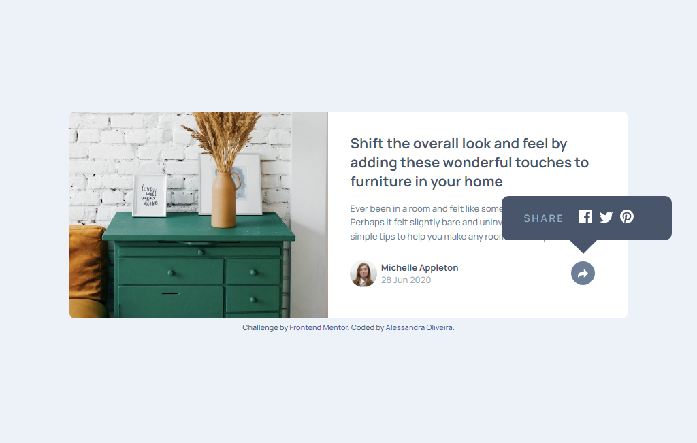
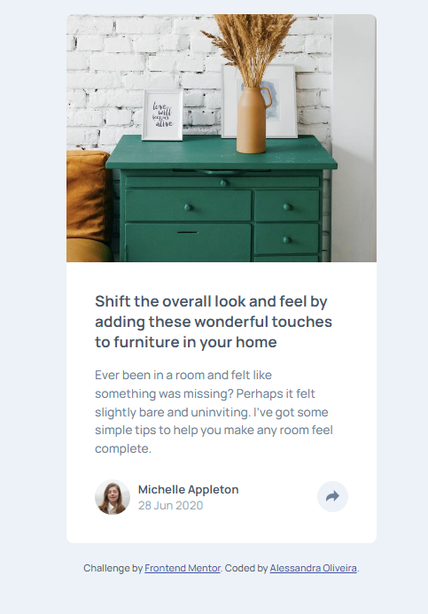
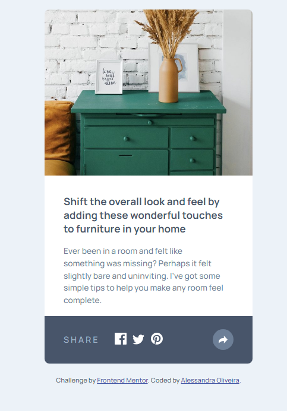

# Frontend Mentor - Article Preview Component Solution

This is a solution to the [Article preview component challenge on Frontend Mentor](https://www.frontendmentor.io/challenges/article-preview-component-dYBN_pYFT). 

## Table of contents

- [Overview](#overview)
  - [The challenge](#the-challenge)
  - [Screenshot](#screenshot)
  - [Links](#links)
- [My process](#my-process)
  - [Built with](#built-with)
- [Author](#author)
  
## Overview

This is my solution to the article preview component challenge. It was built entirely using HTML, CSS and JavaScript. 

### The challenge

Users should be able to:

- View the optimal layout for the component depending on their device's screen size
- See the social media share links when they click the share icon

### Screenshot

**Desktop Soluiton -** this is the desktop solution

  

**Desktop Solution (active mode) -** this is the desktop solution on its active mode, this is what the user sees after clicks the share button

  

**Mobile Soluiton -** this is the mobile solution

  

**Mobile Solution (active mode) -** this is the mobile solution on its active mode, this is what the user sees after clicks the share button

  

### Links

- Solution URL: [Solution on Frontend Mentor](https://www.frontendmentor.io/solutions/article-preview-component-solution-LeZPdoC5np)
- Live Site URL: [Article Preview Component](https://itsale-o.github.io/article-preview-component/)

## My process

### Built with

- Semantic HTML5 markup
- CSS custom properties
- JavaScript

## Author

- Frontend Mentor - [@itsale-o](https://www.frontendmentor.io/profile/itsale-o)
- LinkedIn - [Alessandra Oliveira](https://www.linkedin.com/in/alessandra-santos-oliveira/)
- Twitter - [@itsale_o](https://www.twitter.com/itsale_o)
